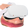

&nbsp;&nbsp;&nbsp;&nbsp;&nbsp;&nbsp;&nbsp;&nbsp;&nbsp;&nbsp;&nbsp;&nbsp;&nbsp;&nbsp;&nbsp;&nbsp;
[![Contributors][contributors-shield]][contributors-url]
[![Forks][forks-shield]][forks-url]
[![Stargazers][stars-shield]][stars-url]
[![Issues][issues-shield]][issues-url]
[![LinkedIn][linkedin-shield]][linkedin-url]

<!-- PROJECT LOGO -->
 

  

<h2 align="center">Discord Bot</h2>
  

     
    <a href="https://github.com/jdanthdavis/vvega-discord-bot/issues">Report Bug</a>
    ·
    <a href="https://github.com/jdanthdavis/vvega-discord-bot/issues">Request Feature</a>
  

<!-- TABLE OF CONTENTS -->

  
Table of Contents

  <ol>
    <li>
      <a href="#about-the-project">About The Project</a>
      <ul>
        <li><a href="#built-with">Built With</a></li>
      </ul>
    </li>
    <li><a href="#usage">Usage</a></li>
    <li><a href="#contributing">Contributing</a></li>
    <li><a href="#contact">Contact</a></li>
  </ol>

<!-- ABOUT THE PROJECT -->

## About The Project

(<a href="#top">back to top</a>)

### Built With

- [Discord.py](https://discordpy.readthedocs.io/en/stable/)
- [MongoDB](https://mongodb.com)
- [Heroku](https://heroku.com)

(<a href="#top">back to top</a>)

<!-- USAGE EXAMPLES -->

## Usage

The purpose of this project was to practice my Python skills while creating a useful tool to use
in my Discord server. I frequently use a "music bot" to play music in our voice channels but most of them
have shutdown. So, I took it upon myself to make my own! Of course, I included some other fun and funny functionality to the bot.

(<a href="#top">back to top</a>)

<!-- CONTRIBUTING -->

## Contributing

Contributions are what make the open source community such an amazing place to learn, inspire, and create. Any contributions you make are **greatly appreciated**.

If you have a suggestion that would make this better, please fork the repo and create a pull request. You can also simply open an issue with the tag "enhancement".
Don't forget to give the project a star! Thanks again!

1. Fork the Project
2. Create your Feature Branch (`git checkout -b feature/AmazingFeature`)
3. Commit your Changes (`git commit -m 'Add some AmazingFeature'`)
4. Push to the Branch (`git push origin feature/AmazingFeature`)
5. Open a Pull Request

(<a href="#top">back to top</a>)

<!-- CONTACT -->

## Contact

[![LinkedIn][linkedin-shield]][linkedin-url]

Project Link: [https://github.com/jdanthdavis/vvega-discord-bot](https://github.com/jdanthdavis/vvega-discord-bot)

(<a href="#top">back to top</a>)

<!-- ACKNOWLEDGMENTS -->

## Acknowledgments

- [Othneildrew's README Template](https://github.com/othneildrew/Best-README-Template)

(<a href="#top">back to top</a>)

[contributors-shield]: https://img.shields.io/github/contributors/jdanthdavis/vvega-discord-bot.svg?style=for-the-badge
[contributors-url]: https://github.com/jdanthdavis/vvega-discord-bot/graphs/contributors
[forks-shield]: https://img.shields.io/github/forks/jdanthdavis/vvega-discord-bot.svg?style=for-the-badge
[forks-url]: https://github.com/jdanthdavis/vvega-discord-bot/network/members
[stars-shield]: https://img.shields.io/github/stars/jdanthdavis/vvega-discord-bot.svg?style=for-the-badge
[stars-url]: https://github.com/jdanthdavis/vvega-discord-bot/stargazers
[issues-shield]: https://img.shields.io/github/issues/jdanthdavis/vvega-discord-bot.svg?style=for-the-badge
[issues-url]: https://github.com/jdanthdavis/vvega-discord-bot/issues
[linkedin-shield]: https://img.shields.io/badge/-LinkedIn-black.svg?style=for-the-badge&logo=linkedin&colorB=555
[linkedin-url]: https://www.linkedin.com/in/justin-davis-514827195/
[product-screenshot]: images/screenshot.png
